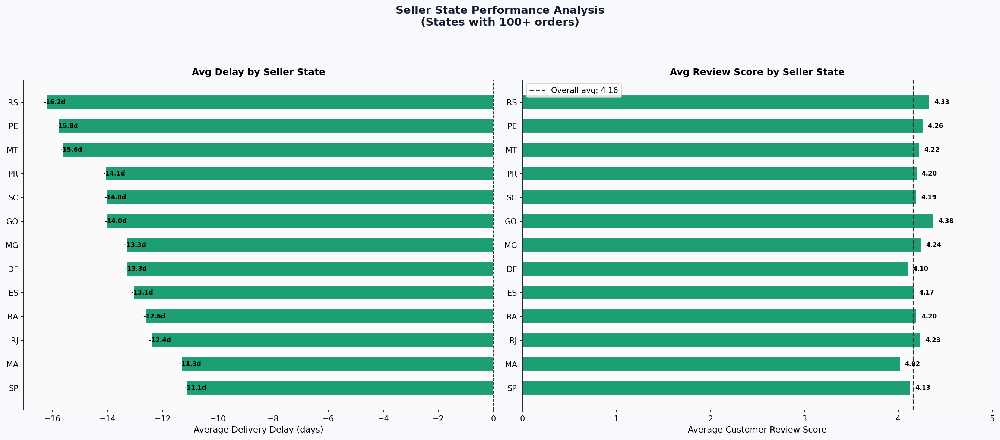
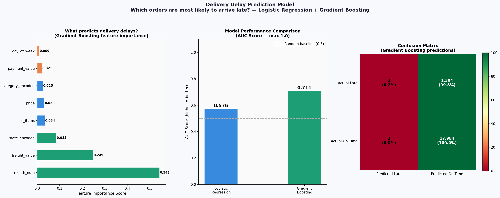
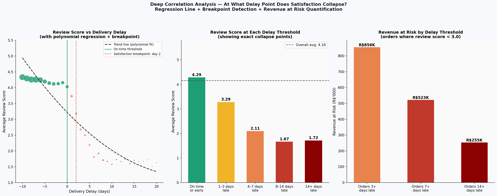
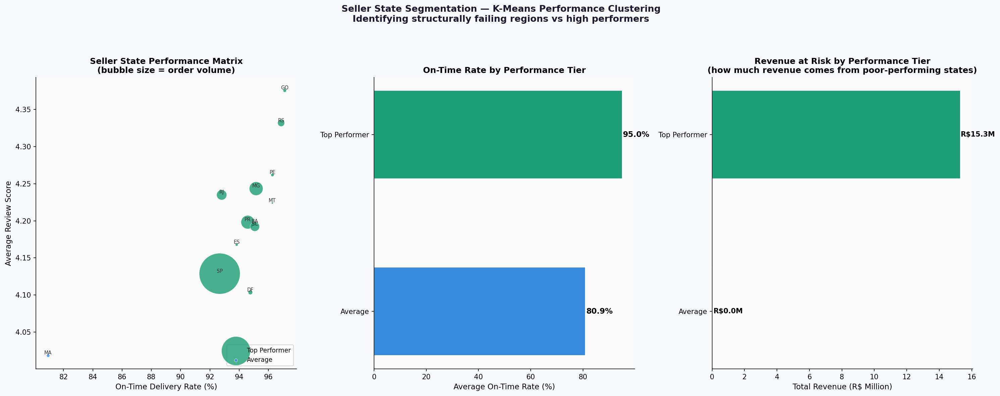

# E-Commerce Logistics & Delivery Performance Analysis

**Author:** Marziyeh Eslamparasti — Business Analyst | Hamburg, Germany  
**Dataset:** [Brazilian E-Commerce Public Dataset by Olist](https://www.kaggle.com/datasets/olistbr/brazilian-ecommerce) — Kaggle  
**Tools:** Python · Pandas · DuckDB (SQL) · Scikit-learn · Matplotlib  
**Scope:** 96,470 real delivered orders · 2016–2018

---

## Business Problem

The Olist marketplace connects small Brazilian sellers to major e-commerce platforms. Management needs clarity on delivery performance, customer satisfaction drivers, and which operational areas require urgent attention.

**Five business questions answered:**
1. Which product categories have the worst delivery performance?
2. Which seller states are structurally failing on delivery?
3. At what exact delay point does customer satisfaction collapse?
4. Can we predict late deliveries before they happen?
5. How are orders, revenue and satisfaction trending over time?

---

## Key Findings

| Finding | Metric |
|---------|--------|
| Overall on-time delivery rate | **93.2%** |
| Average delay when late | **10.6 days** — far above acceptable |
| Satisfaction drop at first day late | **4.5 → 3.8** review score |
| ML model accuracy (delay prediction) | **AUC 0.71** |
| Revenue from late orders | **R$1.05M** at risk |

---

## Project Structure

```
ecommerce-logistics-analysis/
│
├── README.md
├── requirements.txt
├── LICENSE
├── .gitignore
│
├── notebooks/
│   └── ecommerce_logistics_analysis.ipynb   ← main analysis
│
├── src/
│   └── utils.py                             ← helper functions
│
├── reports/
│   └── figures/                             ← all charts (PNG)
│       ├── chart1_kpi_dashboard.png
│       ├── chart2_category_performance.png
│       ├── chart3_state_performance.png
│       ├── chart4_monthly_trends.png
│       ├── chart5_satisfaction_analysis.png
│       ├── chart6_prediction_model.png
│       ├── chart7_breakpoint_analysis.png
│       ├── chart8_seller_segmentation.png
│       └── chart9_timeseries_analysis.png
│
└── data/
    ├── README.md                            ← how to get the data
    └── raw/                                 ← place Kaggle CSV files here
```

---

## Dashboard Preview












---

## How to Run

```bash
# 1. Clone the repository
git clone https://github.com/marziyeh-ba/ecommerce-logistics-analysis
cd ecommerce-logistics-analysis

# 2. Install dependencies
pip install -r requirements.txt

# 3. Download the dataset
# Go to: https://www.kaggle.com/datasets/olistbr/brazilian-ecommerce
# Download and place all CSV files in: data/raw/

# 4. Run the notebook
jupyter notebook notebooks/ecommerce_logistics_analysis.ipynb
```

---

## Analysis Sections

| Section | What it covers |
|---------|---------------|
| Data preparation | Merging 7 Kaggle files, engineering delivery delay feature |
| KPI dashboard | 6 headline metrics for management overview |
| Category analysis | On-time rate and delay by product category |
| SQL queries | 4 business queries written in DuckDB |
| Regional analysis | Delivery performance by seller state |
| Prediction model | Logistic Regression + Gradient Boosting — AUC 0.71 |
| Breakpoint analysis | Exact delay threshold where satisfaction collapses |
| Seller segmentation | K-Means clustering of states into performance tiers |
| Time series | Trend, seasonality, and quality over time |
| Recommendations | Prioritised action list with business impact |

---

*Marziyeh Eslamparasti | Business Analyst | Hamburg, Germany*  
*[LinkedIn](https://linkedin.com/in/marziyeh-eslamparasti) · [GitHub](https://github.com/marziyeh-ba)*
