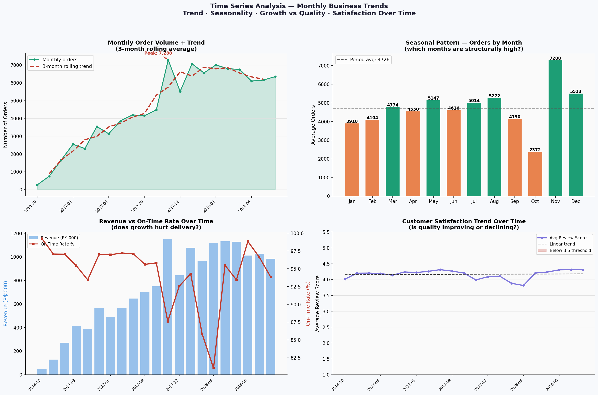

# E-Commerce Logistics & Delivery Performance Analysis

I used the Olist dataset to examine delivery reliability, customer reviews, regional and category differences, and whether information available at order time can help identify late-delivery risk.

**Author:** Marziyeh Eslamparasti — Business Analyst, Hamburg

**Dataset:** [Brazilian E-Commerce Public Dataset by Olist](https://www.kaggle.com/datasets/olistbr/brazilian-ecommerce)

**Tools:** Python · Pandas · DuckDB (SQL) · Scikit-learn · Matplotlib

**Scope:** 96,470 delivered orders from 2016–2018

## Questions I looked at

1. How reliable was delivery performance?
2. Which product categories and seller states were associated with weaker results?
3. How did lateness relate to customer review scores?
4. Can order-time information help screen for late-delivery risk?
5. How did orders, revenue, and service quality change over time?

## Headline results

| Measure | Result | Interpretation |
|---|---:|---|
| On-time delivery rate | **93.2%** | Most delivered orders met the promised date |
| Late delivered orders | **6,573 (6.8%)** | A material operational exception group |
| Average delay among late orders | **10.6 days** | Late orders were often substantially late |
| Average review: on time or early | **4.29 / 5** | Used as the descriptive comparison group |
| Average review: 1–3 days late | **3.29 / 5** | Reviews were lower once the promise date was missed |
| Revenue associated with late orders | **R$1.05M** | Exposure, not proven lost revenue |

These are descriptive results from historical data. They show useful patterns, but they do not prove that a category, seller location, or delivery delay caused an outcome.

## Selected charts




All nine analysis figures and the dashboard PDF are available in [`reports/figures`](reports/figures).

## What I did

- Joined seven Olist source tables into one delivered-order dataset.
- Defined delivery performance against the customer promise date.
- Used DuckDB for reusable business queries and management scorecards.
- Compared categories, seller states, quarters, and monthly trends.
- Examined the relationship between delivery timing and review scores.
- Segmented seller states with K-Means as an exploratory pattern-finding step.
- Built an imbalance-aware logistic-regression benchmark for late-delivery screening.

### A problem I found in the first model

The first model produced a ROC-AUC of about **0.71**, but at the default threshold it identified only **3 of 1,307** late orders—about **0.2% recall**. That result is not useful for an operations team, even though the AUC initially looks reasonable.

I kept `chart6_prediction_model.png` to document the original result. In the revised notebook, `late = 1` is the target, categorical variables are one-hot encoded, class weights are used, and the threshold is selected on validation data. The final evaluation reports ROC-AUC, PR-AUC, precision, recall, F1, and the confusion matrix.

It is still a benchmark, not a production model. Before using it in a real workflow, I would define the costs of missed delays and false alerts, validate it on later orders, and monitor performance over time.

## Repository structure

```text
ecommerce-logistics-analysis/
├── data/
│   ├── README.md
│   └── raw/                         # local source CSVs; not committed
├── notebooks/
│   └── ecommerce_logistics_analysis.ipynb
├── reports/
│   └── figures/
├── src/
│   └── utils.py
├── .gitignore
├── LICENSE
├── README.md
└── requirements.txt
```

## Run locally

```bash
git clone https://github.com/marziyeh-ba/ecommerce-logistics-analysis.git
cd ecommerce-logistics-analysis
python -m venv .venv
source .venv/bin/activate       # Windows: .venv\Scripts\activate
pip install -r requirements.txt
jupyter notebook notebooks/ecommerce_logistics_analysis.ipynb
```

Before running the notebook, download the Olist dataset and place the seven required CSV files in `data/raw/`. Exact filenames are listed in [`data/README.md`](data/README.md).

DuckDB is used locally for SQL analysis. The business logic can be transferred to PostgreSQL, Snowflake, or Azure SQL, but functions, identifiers, and syntax may require adaptation.

## Notes on interpretation

- The data covers one historical marketplace and should not be treated as current Brazilian e-commerce performance.
- Regional and category comparisons are descriptive; carrier, route, buyer-location, and product-level controls would be needed for causal conclusions.
- “Revenue associated with late orders” is exposure within affected orders, not a measured financial loss.
- Cluster labels are analytical summaries, not formal supplier ratings.

## Methods used

Business analysis · KPI design · SQL · Python · data preparation · exploratory analysis · customer-experience analysis · predictive-model evaluation · stakeholder-oriented communication

---

[LinkedIn](https://linkedin.com/in/marziyeh-eslamparasti) · [GitHub portfolio](https://github.com/marziyeh-ba)
