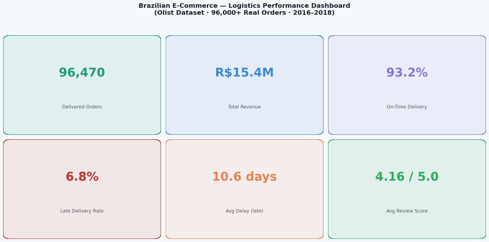
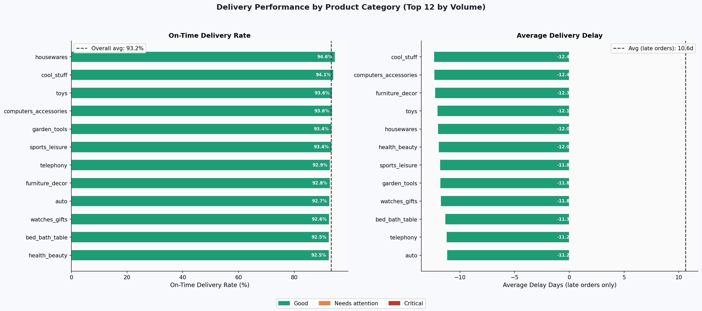
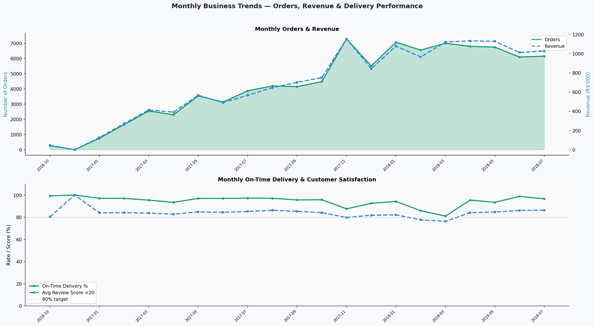
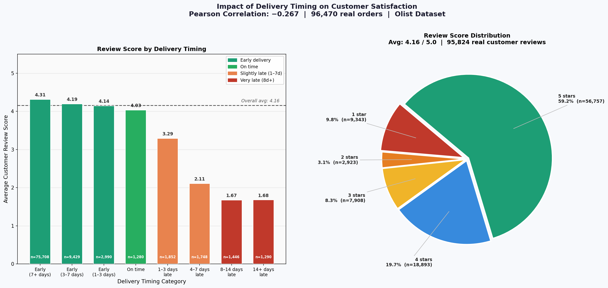

# E-Commerce Logistics & Delivery Performance Analysis

**Tools:** Python · Pandas · Matplotlib · Seaborn  
**Dataset:** [Brazilian E-Commerce Public Dataset by Olist](https://www.kaggle.com/datasets/olistbr/brazilian-ecommerce) — Kaggle  
**Domain:** E-Commerce · Logistics · Supply Chain Analytics  
**Data:** 96,470 real delivered orders · 2016–2018

---

## Business Problem

Olist connects small Brazilian sellers to major marketplaces. Management needs clear visibility into delivery performance, customer satisfaction, and regional logistics issues — to make data-driven operational decisions.

**4 business questions answered:**
1. What percentage of orders arrive on time — and which categories underperform?
2. Which seller states cause the most delivery delays?
3. Is there a measurable link between late delivery and customer ratings?
4. How are orders, revenue and performance trending over time?

---

## Key Findings

| Finding | Metric |
|---------|--------|
| Overall on-time delivery rate | **93.2%** |
| Average delay when late | **10.6 days** |
| Average customer review score | **4.16 / 5.0** |
| Correlation: delay vs review score | **−0.267** (significant) |
| Review score — early deliveries | **4.5+** |
| Review score — 8–14 days late | **~2.5** |
| % of dissatisfied customers (score ≤2) who received late orders | **~60%** |

---

## Dashboard Preview










---

## Recommendations

1. **Immediate:** Real-time delay alert system — flag orders predicted 3+ days late for proactive customer contact
2. **Short-term:** Renegotiate carrier SLAs for high-delay seller states
3. **Medium-term:** Investigate fulfilment centre positioning for remote states
4. **Ongoing:** Seller scorecard dashboard — rank sellers by on-time rate publicly

---

## Project Structure

```
ecommerce-logistics-analysis/
│
├── ecommerce_logistics_analysis.ipynb  # Full analysis notebook
├── olist_orders_dataset.csv            # Orders (99,441 rows)
├── olist_order_items_dataset.csv       # Items per order
├── olist_order_reviews_dataset.csv     # Customer reviews
├── olist_products_dataset.csv          # Product catalogue
├── olist_sellers_dataset.csv           # Seller information
├── product_category_name_translation.csv
├── chart1_kpi_dashboard.png
├── chart2_category_performance.png
├── chart3_state_performance.png
├── chart4_monthly_trends.png
├── chart5_satisfaction_analysis.png
└── README.md
```

---

## How to Run

```bash
git clone https://github.com/marziyehSP/ecommerce-logistics-analysis
cd ecommerce-logistics-analysis
pip install pandas numpy matplotlib seaborn jupyter
jupyter notebook ecommerce_logistics_analysis.ipynb
```

**Data source:** Download the dataset from [Kaggle](https://www.kaggle.com/datasets/olistbr/brazilian-ecommerce) and place all CSV files in the same folder.

---

*Marziyeh Eslamparasti — Business Analyst | Hamburg, Germany*  
*[LinkedIn](https://linkedin.com/in/marziyeh-eslamparasti)*

---
## Dashboard

 download the PDF: [link to PDF in repo]
